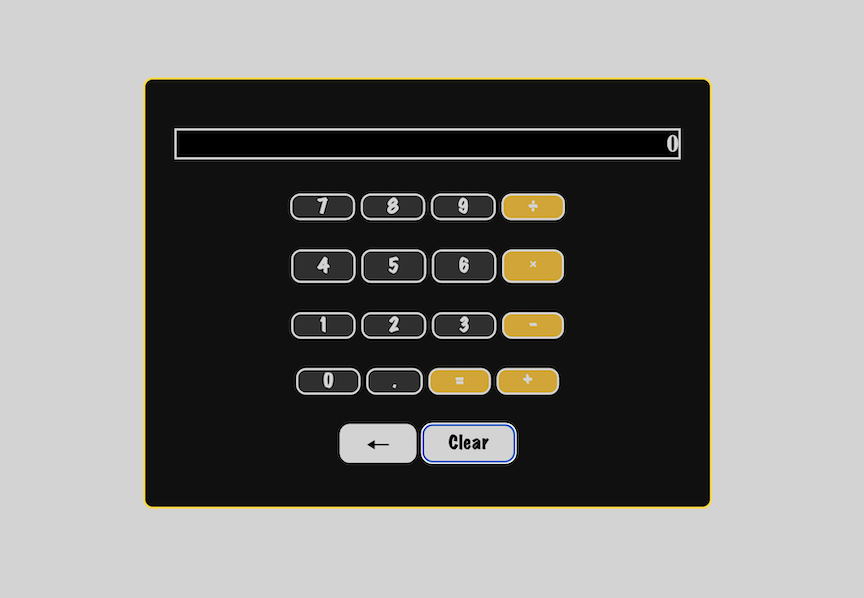

<h2>Simple Calculator App</h2>

A basic calculator HTML application built with a focus on usability and simplicity. This app supports standard arithmetic operations and is optimized for use on Windows systems.

<h4>Features</h4>

Perform basic calculations: addition, subtraction, multiplication, division, and supports decimal values.

Click-based interface optimized for mouse use

Keyboard input supported for quick data entry

Clean and minimal user interface

<h4>Platform Compatibility</h4>

Optimized for: Windows

May run on other platforms, but Windows users will have the best experience

<h4>Usage</h4>

Clone the repository

Open index.html in your browser (paste path into browser URL)

Use the mouse or keyboard to input numbers and operations

View results instantly in the display area

<h4>Contributing</h4>

This is a simple project meant for learning and basic use. Contributions are welcome for enhancements, UI improvements, or cross-platform support.

